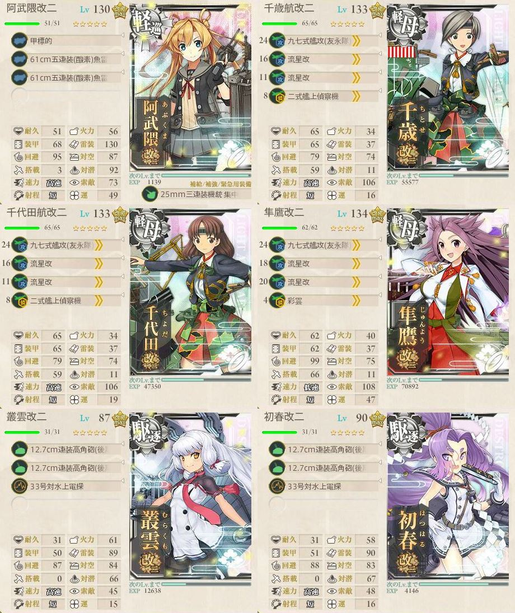
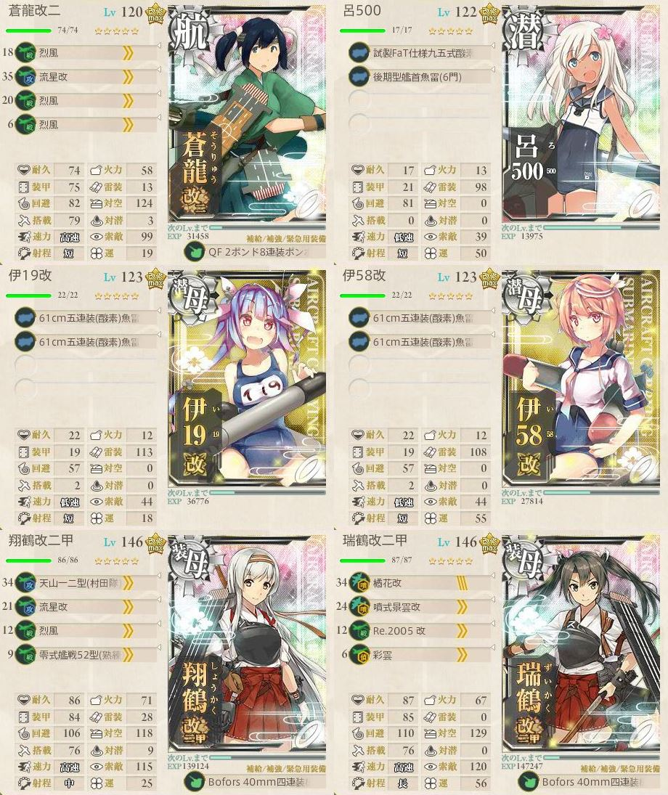

# 鎮守府海域

## 1-1 鎮守府正面海域

## 1-2 南西諸島沖

## 1-3 製油所地帯沿岸

## 1-4 南西諸島防衛戦

## 1-5 鎮守府近海

## 1-6 鎮守府近海航路

# 南西諸島海域

## 2-1 カムラン半島

## 2-2 バシー島沖

## 2-3 東部オリョール海

## 2-4 沖ノ島海域

## 2-5 沖ノ島沖
### 通常攻略(下3戦ルート)  
一定の練度は必要だが、ルート固定かつ低燃費で攻略可能。  
駆逐艦を旗艦にすると安定するかもしれない。  

二戦目でたまに大破撤退する。  

### 【マンスリー】「第五戦隊」出撃せよ(上3戦ルート)
必須艦は、妙高・那智・羽黒  

# 北方海域

## 3-1 モーレイ海

## 3-2 キス島沖

## 3-3 アルフォンシーノ方面

## 3-4 北方海域全域

## 3-5 北方AL海域
### 通常攻略(上4戦ルート)
空母×3、潜水×3編成で攻略。  
道中撤退の大半が潜水艦のため、噴出爆撃機で手数を増やす。  

大破するときは大破するので、根気よくチャレンジ。  

# 西方海域

## 4-1 ジャム島攻略作戦

## 4-2 カレー洋制圧戦

## 4-3 リランカ島空襲

## 4-4 カスガダマ沖海戦

## 4-5 カレー洋リランカ島沖

# 南方海域

## 5-1 南方海域全面

## 5-2 珊瑚諸島沖

## 5-3 サブ島沖海域

## 5-4 サーモン海域

## 5-5 サーモン海域北方

# 中部海域

## 6-1 中部海域哨戒線

## 6-2 MS諸島沖

## 6-3 グアノ環礁沖海域

## 6-4 中部北海域ピーコック島沖

## 6-5 KW環礁沖海域

