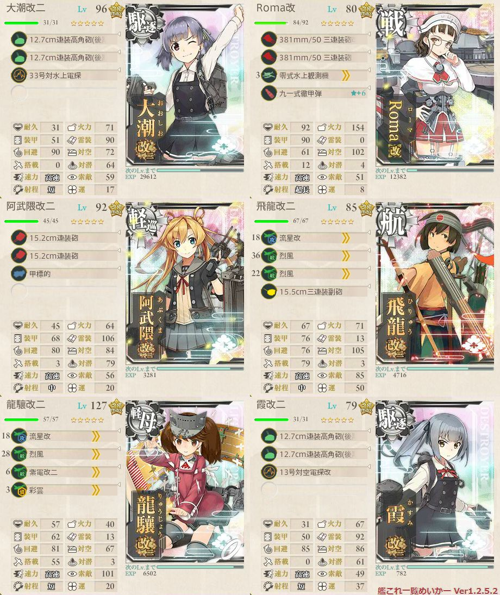

# 【艦これ】2017夏イベ「西方再打通！欧州救援作戦」
## E-1「再打通作戦発動」
### 甲作戦

ルート|判定 |艦娘 |備考
:---  |:---:|:---:|:---
IJCDP |S    |伊19 |道中支援
IJCDP |S    |鹿島 |
IJCDP |S    |綾波 |
IJCDP |S    |綾波 |
IJCDP |A    |隼鷹 |ラスト

---

## E-2「リランカを越えて」
### 甲作戦
#### ギミック解除

ルート|判定 |艦娘   |備考
:---  |:---:|:---:  |:---
DEGI  |A    |電     |

#### 攻略

ルート|判定 |艦娘   |備考
:---  |:---:|:---:  |:---
ACFJLO|A    |隼鷹   |道中支援
ACFJLO|A    |筑摩   |
ACFJLO|S    |龍驤   |
ACFJLO|A    |春風   |
ACFJLO|A    |阿賀野 |
ACFJLO|A    |足柄   |
ACFJLO|A    |愛宕   |
ACFJL |撤退 |       |
ACFJL |撤退 |       |
ACFJLO|S    |飛鷹   |
ACFJL |撤退 |       |
ACFJL |撤退 |       |
ACFJLO|A    |名取   |
ACFJLO|A    |多摩   |道中・決戦支援
ACF   |撤退 |       |
ACFJLO|A    |鳳翔   |
ACFJLO|A    |北上   |
ACFJLO|A    |那珂   |
ACFJLO|A    |親潮   |
ACFJLO|A    |川内   |
ACFJLO|A    |青葉   |
ACFJL |撤退 |       |
AC    |撤退 |       |
ACFJL |撤退 |       |
ACFJLO|A    |伊168  |
ACFJLO|A    |金剛   |
ACFJL |撤退 |       |
ACFJL |撤退 |       |
ACFJLO|A    |愛宕   |
ACFJL |撤退 |       |
ACFJLO|A    |敷波   |

---

## E-3「ステビア海の先へ」
### 甲作戦
#### 輸送ゲージ

ルート  |判定 |艦娘   |備考
:---    |:---:|:---:  |:---
ACDEHKL |A    |大潮   |道中・決戦支援
ACDEHKL |A    |摩耶   |
ACDEH   |撤退 |       |
ACDE    |撤退 |       |
ACD     |撤退 |       |
ACDEHKL |C    |       |
ACDEHKL |S    |最上   |
ACDEHKL |A    |筑摩   |
ACD     |撤退 |       |
ACDEHKL |C    |       |
ACDEHKL |D    |       |
ACDEHKL |S    |藤波   |

#### 戦力ゲージ

ルート  |判定 |艦娘   |備考
:---    |:---:|:---:  |:---
ACDEHMQ |A    |天津風 |決戦支援
ACDEHMNQ|A    |秋雲   |
ACDEHMQ |A    |朝霜   |
ACDEHMQ |A    |名取   |
ACDEHMNQ|A    |伊勢   |
ACDEHMNQ|A    |三隈   |
ACDEHMNQ|A    |秋雲   |
ACDEHNQ |S    |三隈   |
ACD     |撤退 |       |
ACDEHM  |撤退 |       |
ACD     |撤退 |       |
ACDEHN  |撤退 |       |
ACDEHNQ |A    |阿武隈 |
ACDEHM  |撤退 |       |
ACDEHMQ |A    |山城   |
ACDEHMQ |A    |天城   |
ACDEHN  |撤退 |       |
ACD     |撤退 |       |
ACDEHNQ |A    |由良   |
ACDEHNQ |A    |木曾   |
ACD     |撤退 |       |
ACD     |撤退 |       |
ACDEHMN |撤退 |       |
ACDEHMN |撤退 |       |
ACDEHNQ |A    |最上   |
ACDEHM  |撤退 |       |
ACDEHNQ |A    |加賀   |
ACDEHNQ |A    |長良   |
ACDEHMNQ|A    |巻雲   |
ACDEHMNQ|A    |加古   |
ACDEHMN |撤退 |       |
ACDEHMNQ|A    |神通   |
ACDEHMQ |A    |日向   |

> 行き詰まったので、艦隊の変更。

ルート  |判定 |艦娘   |備考
:---    |:---:|:---:  |:---
ACDEHMNQ|A    |神通   |空母機動部隊
ACDEHMQ |S    |三隈   |

---

## E-4「遥かなるスエズ」
### 乙作戦
#### 第一段階

ルート  |判定 |艦娘   |備考
:---    |:---:|:---:  |:---
ABC     |撤退 |       |
ABCGHI  |S    |浜風   |
ABCGHI  |S    |熊野   |
A       |撤退 |       |
ABCGHI  |S    |野分   |
ABCGHI  |A    |青葉   |

#### 第二段階

ルート  |判定 |艦娘   |備考
:---    |:---:|:---:  |:---
DGHJKMN |S    |春雨   |
DGHJKM  |撤退 |       |
DGHJKMN |A    |那智   |
DGHJKMN |A    |由良   |
DGHJKMN |A    |如月   |
DGHJKMN |S    |水無月 |
DGHJKMN |A    |卯月   |ラスト
DGHJKMN |A    |最上   |
DGHJKMN |S    |沖波   |

---

## E-5「地中海への誘い」
### 甲作戦

ルート  |判定 |艦娘   |備考
:---    |:---:|:---:  |:---
ABC     |S    |       |ギミック解除
ABDEFIK |撤退 |       |攻略開始
ABDEF   |撤退 |       |
ABDEF   |撤退 |       |
ABDEF   |撤退 |       |
ABDEFIKM|A    |多摩   |
ABDEFIKM|S    |最上   |
ABDEF   |撤退 |       |
ABDEF   |撤退 |       |
ABDEF   |撤退 |       |
ABDEFIKM|A    |択捉   |
ABDEF   |撤退 |       |
ABDEFIKM|A    |朝雲   |
ABDEFIKM|A    |名取   |
ABDEFIKM|A    |球磨   |
ABDE    |撤退 |       |

> ラストダンスのため、編成変更  
> スクショは攻略後なので、攻略時は別装備。

ルート  |判定 |艦娘   |備考
:---    |:---:|:---:  |:---
AB      |撤退 |       |ラスト
ABDEFIKM|S    |利根   |

---

## E-6「マルタ島沖海戦」
### 乙作戦
#### 輸送作戦(水上部隊で挑戦可能)

TPゲージ:1,500  
画像の装備でS勝利時にTP値93削り  

ルート  |判定 |艦娘   |備考
:---    |:---:|:---:  |:---
ACE     |撤退 |       |
ABDFH   |S    |妙高   |TP削り:93
ABDFH   |S    |飛龍   |
ABDFH   |S    |高波   |如月⇔照月、如月に大発 TP削り:109
ABDFH   |S    |夕張   |
ABDFH   |S    |瑞鶴   |
ABDFH   |S    |妙高   |
ABDFH   |S    |野分   |
ABDFH   |S    |祥鳳   |
AB      |撤退 |       |
ABDFH   |S    |飛龍   |
ABDFH   |A    |北上   |
ABDFH   |S    |鈴谷   |
ABDFH   |A    |巻雲   |
ABDFH   |A    |巻雲   |
ABDFH   |S    |夕張   |
ABDFH   |S    |最上   |
ABD     |撤退 |       |
ABDFH   |S    |飛鷹   |

#### ギミック解除(Hマス)

ルート  |判定 |艦娘   |備考
:---    |:---:|:---:  |:---
ABDFH   |A    |熊野   |

#### ギミック解除(Oマス)

ルート  |判定 |艦娘   |備考
:---    |:---:|:---:  |:---
KMNP    |撤退 |       |護衛退避で逸れ
KMNO    |S    |木曾   |

#### 攻略(戦力ゲージ)

ルート  |判定 |艦娘   |備考
:---    |:---:|:---:  |:---
KMPS    |S    |妙高   |
K       |撤退 |       |
KMPS    |S    |榛名   |
KMPS    |S    |長波   |
KMPS    |S    |大井   |
KM      |撤退 |       |ラスト 大井を対潜→副砲、阿武隈を対潜強化
KM      |撤退 |       |
KMPS    |S    |加賀   |

---

## E-7「ドーバー海峡沖海戦」
### 丙作戦
#### ギミック解除

ルート  |判定 |艦娘   |備考
:---    |:---:|:---:  |:---
CA      |撤退 |       |空母機動部隊
CAEIKOR |S    |嵐     |
CGDFHLP |A    |       |ルート解放
CAEIK   |撤退 |       |
CAEIKOR |S    |－     |

ルート  |判定 |艦娘   |備考
:---    |:---:|:---:  |:---
CGHLP   |S    |－     |輸送護衛部隊

#### 攻略

ルート  |判定 |艦娘   |備考
:---    |:---:|:---:  |:---
        |     |       |

---

## E-8～11「新艦掘り」

有力な情報が出揃うまで、資源回復と新艦の掘りを実施。

### 狭霧
#### ギミック解除

ルート  |判定 |艦娘   |備考
:---    |:---:|:---:  |:---
IHKM    |     |－     |Qマス出現
IHKQ    |     |－     |R,Sマス出現

#### 掘り(E-1-S)

ルート  |判定 |艦娘   |備考
:---    |:---:|:---:  |:---
IJLNRS  |S    |－     |
IJLNRS  |S    |神通   |
IJLNRS  |S    |－     |
IJLNR   |撤退 |       |
IJLNRS  |S    |川内   |
IJLNRS  |S    |衣笠   |
IJLNRS  |S    |－     |
IJLNRS  |S    |－     |
IJLNRS  |S    |－     |
IJLNRS  |S    |妙高   |
IJLNRS  |S    |－     |S勝利10回
IJLNRS  |S    |妙高   |
IJLNRS  |S    |羽黒   |
IJLNRS  |S    |－     |
IJLNRS  |S    |－     |
IJLNRS  |S    |千歳   |
IJLNRS  |S    |那珂   |
IJLNRS  |S    |敷波   |
IJLNRS  |S    |球磨   |
IJLNRS  |S    |－     |
IJLNRS  |S    |山風   |S勝利20回
IJLNRS  |S    |由良   |
IJLNRS  |S    |－     |
IJLNRS  |S    |－     |
IJLNRS  |S    |－     |
IJLNRS  |S    |千歳   |
IJLNRS  |S    |－     |
IJLNRS  |S    |敷波   |
IJLN    |撤退 |       |
IJLNRS  |S    |－     |
IJLNRS  |S    |綾波   |
IJLNRS  |S    |木曾   |S勝利30回
IJLNRS  |S    |綾波   |
IJLNRS  |S    |－     |
IJLNRS  |S    |北上   |
IJLNRS  |S    |－     |
IJLNRS  |S    |由良   |
IJLNRS  |S    |狭霧   |

### 天霧
#### 掘り(E-4-I)

ルート  |判定 |艦娘   |備考
:---    |:---:|:---:  |:---
DGHI    |B    |       |輸送護衛部隊
DGHI    |B    |       |
DGHI    |A    |筑摩   |決戦支援
DGHI    |A    |鳥海   |
DGHI    |A    |妙高   |
DGHI    |A    |羽黒   |
DGHI    |A    |長良   |
DGHI    |B    |       |
DGHI    |A    |最上   |
DGHI    |A    |陸奥   |
DGHI    |A    |由良   |
DGHI    |A    |摩耶   |
DGHI    |A    |多摩   |A勝利10回
DGHI    |A    |羽黒   |
DGHI    |A    |浦風   |
DGHI    |A    |浦風   |
DGHI    |A    |妙高   |
DGHI    |A    |加古   |
D       |撤退 |       |
DGHI    |B    |       |
DGHI    |A    |球磨   |
DGHI    |A    |由良   |
DGHI    |A    |由良   |
DGHI    |A    |沖波   |
DGHI    |A    |球磨   |A勝利20回
DGHI    |A    |多摩   |
DGHI    |A    |熊野   |
DGHI    |C    |       |
DGHI    |A    |熊野   |
D       |撤退 |       |
DGHI    |A    |加古   |
DGHI    |A    |天霧   |

### 松輪
#### 掘り(E-5-M)

ルート  |判定 |艦娘   |備考
:---    |:---:|:---:  |:---
ABDEF   |撤退 |       |
ABDEFIKM|S    |筑摩   |
ABDEFIKM|S    |筑摩   |
A       |撤退 |       |
ABDEFIKM|S    |伊勢   |
ABDEFIKM|S    |最上   |
ABDEFIKM|S    |伊勢   |
ABDEF   |撤退 |       |
ABDEFIKM|S    |山城   |
ABDEFIKM|S    |高雄   |
ABDEFIKM|S    |日向   |
ABDEFIK |撤退 |       |
ABDEFIKM|S    |陸奥   |
ABDEFIKM|S    |陸奥   |勝利10回
ABDEFIKM|A    |扶桑   |
ABDEF   |撤退 |       |
ABDEFIKM|A    |由良   |
ABDEF   |撤退 |       |
ABDEFIKM|A    |利根   |
ABDEFIKM|A    |那珂   |
ABDEF   |撤退 |       |
ABDEFIKM|A    |日向   |
ABDEF   |撤退 |       |
ABDEF   |撤退 |       |
ABDEFIKM|S    |榛名   |
ABDEFIKM|S    |山雲   |
ABDEF   |撤退 |       |
ABDEFIKM|S    |山雲   |
ABDEF   |撤退 |       |
ABDEFIKM|S    |伊勢   |
A       |撤退 |       |
ABDEFIKM|A    |川内   |勝利20回
ABDEFIKM|A    |陸奥   |
ABDEF   |撤退 |       |
ABDEF   |撤退 |       |
ABDEFIKM|S    |雪風   |
ABDEF   |撤退 |       |
ABD     |撤退 |       |
ABDEFIKM|S    |雪風   |
ABDEFIKM|S    |最上   |
ABDEFIKM|A    |伊勢   |
ABDEFIKM|S    |山雲   |
ABDEFIKM|A    |多摩   |
ABDEFIKM|A    |足柄   |
ABDEFIKM|A    |日向   |
ABDEFIK |撤退 |       |
ABDEFIKM|S    |筑摩   |勝利30回
ABDEFIKM|A    |利根   |
ABDEFIKM|S    |筑摩   |
ABDEFIKM|S    |日向   |
ABDEFIKM|S    |愛宕   |
ABDEFIKM|A    |足柄   |
ABDEF   |撤退 |       |
ABDEFIK |撤退 |       |
ABDE    |撤退 |       |
ABDEF   |撤退 |       |
ABDEFIKM|A    |松輪   |

### Luigi Torelli
#### 掘り(E-6-S)

ルート  |判定 |艦娘   |備考
:---    |:---:|:---:  |:---
        |     |       |

