# 【艦これ】2017秋イベ  捷号決戦！邀撃、レイテ沖海戦(前篇)

## 資材状況

状況      |燃料   |弾薬   |鋼材   |ボーキ |バケツ
:--:      |---:   |---:   |---:   |---:   |---:
開始前    |298,793|297,960|298,092|299,694|2,999
E-1攻略後 |297,046|297,303|298,674|296,305|2,987
E-2攻略後 |285,793|284,523|295,644|295,937|2,927
E-3攻略後 |281,250|277,996|296,017|294,565|2,898
E-4攻略後 |287,276|285,775|298,065|295,688|2,911

## E-1「第二遊撃部隊、抜錨！」
甲と報酬がほとんど変わらないため、乙作戦で攻略を開始する。

### 乙作戦
#### ギミック解除

隼＋艦戦3で制空マスに基地航空支援隊を出撃。

ルート  |判定 |艦娘 |備考
:---    |:---:|:---:|:---
ABCGDEHF|     |     |
ABCGJKL |     |     |潜水艦単艦 ギミック解除
ABCGJMNP|     |     |
ABCGJMOS|S    |飛鷹 |ギミック解除→BOSS突入

#### 攻略
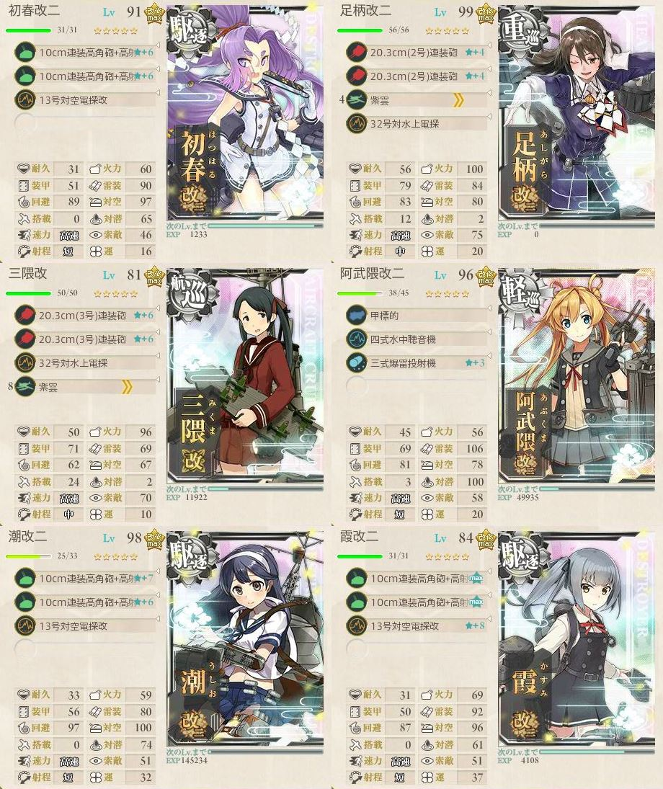

陸攻4でBOSSマスに基地航空支援隊を出撃。

ルート  |判定 |艦娘   |備考
:---    |:---:|:---:  |:---
ABCGJMOS|S    |秋雲   |道中支援(対潜)
ABCGJMOS|S    |伊勢   |
ABCGJMOS|S    |飛鷹   |
ABCGJMOS|S    |阿武隈 |ラストダンス 決戦支援

---

## E-2「捷一号作戦、発動準備」
### 甲作戦
遊撃部隊で7隻編成のため、第三艦隊を使用。

#### ギミック解除
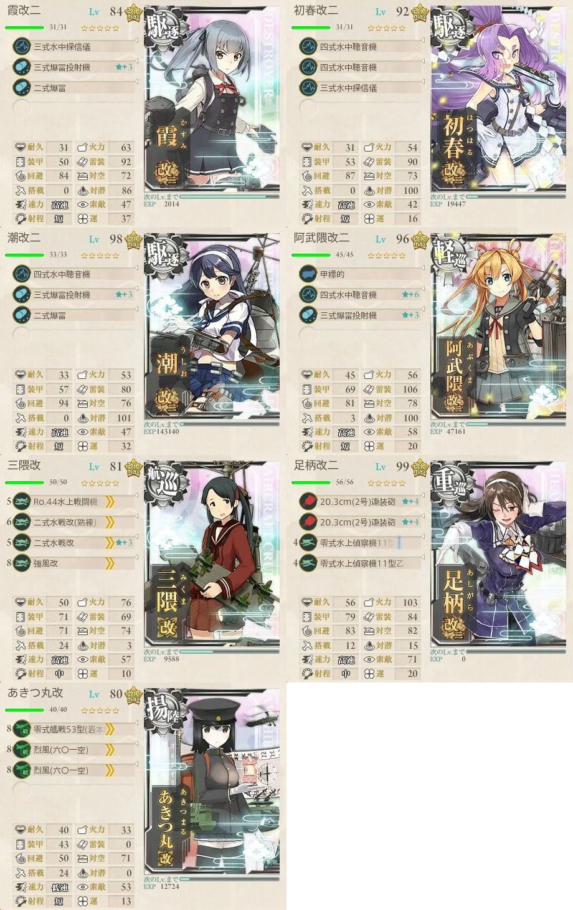
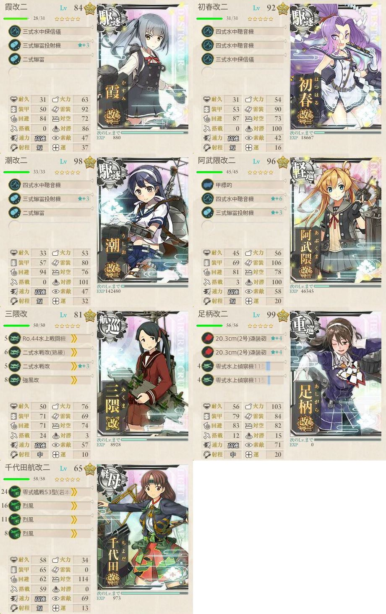

ルート|判定 |艦娘 |備考
:---  |:---:|:---:|:---
ABCEGJ|S    |若葉 |
AD    |     |     |

#### 攻略

試行錯誤した結果、下記の編成が最終型。

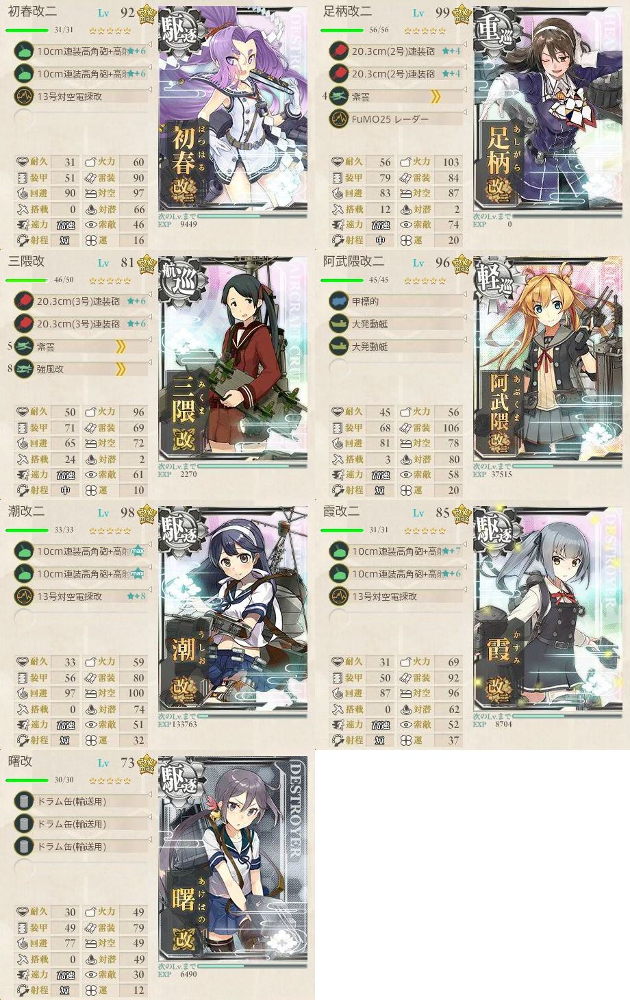

ルート|判定 |艦娘   |備考
:---  |:---:|:---:  |:---
QLM   |撤退 |       |道中支援
QLM   |撤退 |       |
QLMN0 |     |       |索敵漏れ 装備変更
QLMNP |A    |春雨   |TP45
QL    |撤退 |       |
QLMNP |S    |能代   |TP65
QL    |撤退 |       |阿武隈の装備を主砲2に変更
QLMNP |D    |       |
QL    |撤退 |       |三隈・阿武隈の装備を変更
QLMNP |C    |       |
QLMNP |A    |阿賀野 |TP39 決戦支援に変更 装備変更
Q     |撤退 |       |
QL    |撤退 |       |
QLMNP |A    |野分   |TP45
QL    |撤退 |       |
QL    |撤退 |       |
QLMNP |A    |対馬   |TP45
QLMNP |S    |清霜   |TP65
QL    |撤退 |       |
QLMNP |A    |青葉   |TP45
QLMNP |A    |谷風   |TP25
QL    |撤退 |       |
QLMNP |A    |熊野   |TP26

---

## E-3「捷一号作戦、作戦発動！」
### 甲作戦
#### 撃破ゲージ１

Aに対潜航空支援、Gに基地航空支援

ルート|判定 |艦娘 |備考
:---  |:---:|:---:|:---
ABCFG |A    |-    |決戦支援
ABCFG |A    |-    |
ABCFG |A    |村雨 |
ABCFG |S    |若葉 |
ABCFG |A    |-    |
A     |撤退 |     |ラスト
ABCFG |A    |-    |
ABCFG |A    |-    |
ABCFG |S    |暁   |

#### 防空ギミック

バケツ消費を減らすために、撃破ゲージ①のルートで空襲に対応

ルート|判定 |艦娘 |備考
:---  |:---:|:---:|:---
ABCD  |     |     |
ABCD  |     |     |
ABCD  |     |     |
ABCD  |     |     |基地被害なし

#### 輸送ゲージ
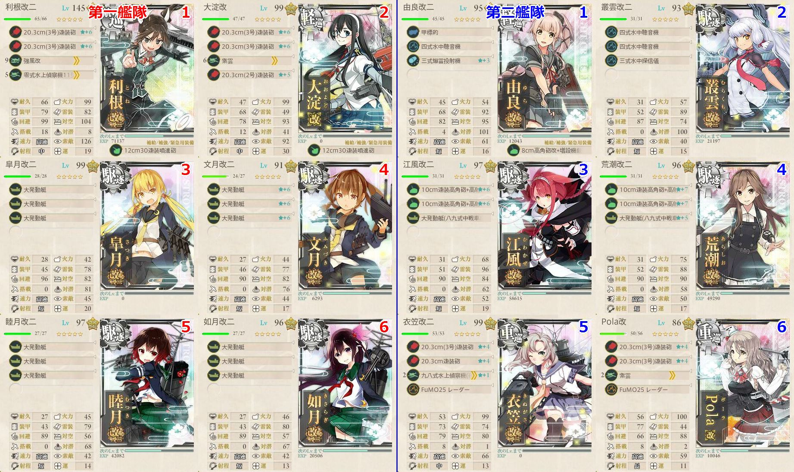

Dに対潜航空支援、Jに基地航空支援

ルート|判定 |艦娘   |備考
:---  |:---:|:---:  |:---
BDEHJ |C    |       |道中支援
B     |撤退 |       |道中支援・決戦支援
BDEHJ |A    |筑摩   |TP108
BDE   |撤退 |       |
BDEHJ |A    |鳥海   |TP108
BDE   |撤退 |       |
BDEHJ |A    |高波   |TP108
BDE   |撤退 |       |
BDE   |撤退 |       |
BDE   |撤退 |       |
BDE   |撤退 |       |
B     |撤退 |       |大淀の装備を艦隊司令部編成に変更
BDEHJ |A    |最上   |TP108
BDEHJ |A    |時津風 |TP108
BDEHJ |A    |足柄   |TP97
BDEHJ |A    |鬼怒   |TP63

#### 戦力ゲージ２
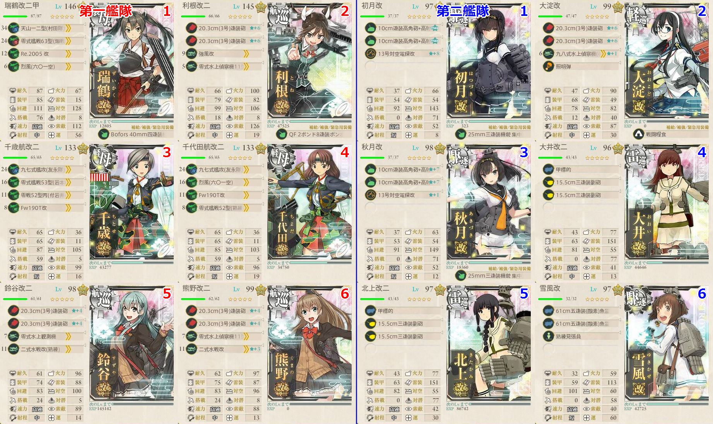

ルート|判定 |艦娘   |備考
:---  |:---:|:---:  |:---
OMP   |撤退 |       |
OMPRS |S    |伊400  |
OMP   |撤退 |       |
OMPRS |S    |伊勢   |瑞鶴の装備を噴出爆撃機に変更
OMPRS |A    |春日丸 |
OMPRS |S    |電     |
OMPRS |B    |球磨   |道中支援
OMPRS |S    |長門   |道中支援 決戦支援

---

## E-4「あの海峡の先へ―」

タイトルがかっこいい。燃える。

### 丙作戦
#### ギミック１
##### UマスA勝利(連合艦隊)
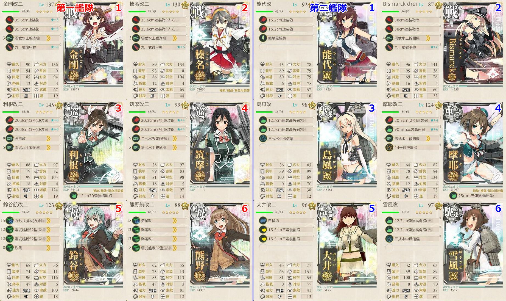

ルート  |判定 |艦娘   |備考
:---    |:---:|:---:  |:---
CFDGLPU |S    |満潮   |

##### Xマス到達・YマスA勝利(志摩艦隊)
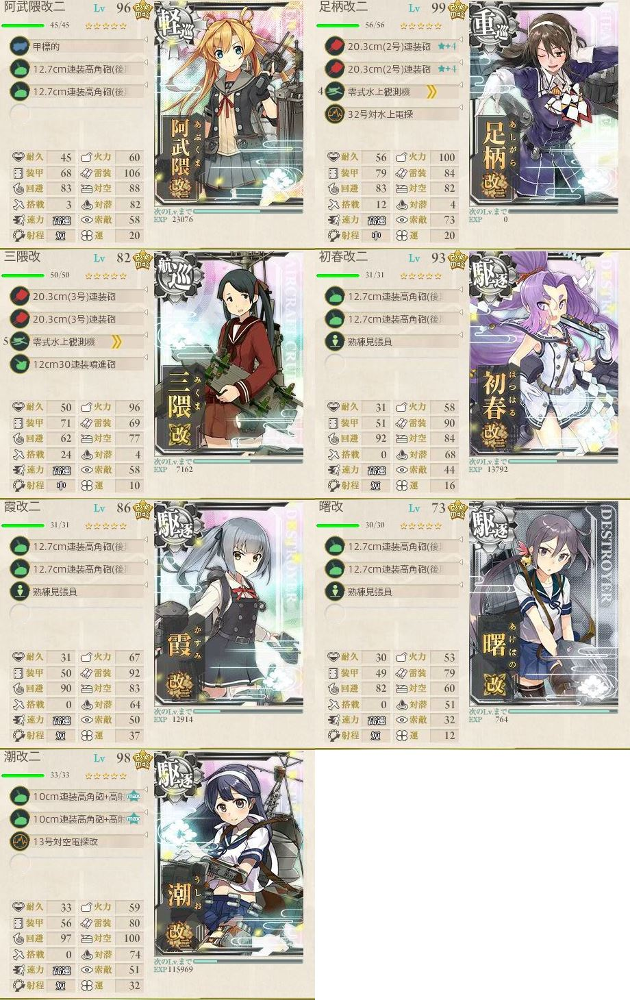

ルート  |判定 |艦娘   |備考
:---    |:---:|:---:  |:---
QT      |撤退 |       |
QTVX    |撤退 |       |
QTVXY   |S    |時雨   |

#### ギミック２
##### Z6マスS勝利(連合艦隊)
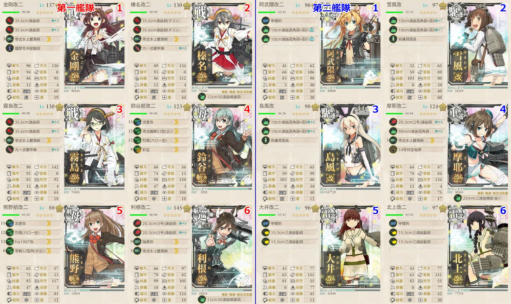

ルート            |判定 |艦娘   |備考
:---              |:---:|:---:  |:---
CFDGLPUZ1Z2Z3Z4Z6 |S    |満潮   |

##### Z8マスA勝利(志摩艦隊)

阿武隈は連撃装備に変更 
道中夜戦マスのため、重巡には照明弾をもたせた。

ルート    |判定 |艦娘   |備考
:---      |:---:|:---:  |:---
QT        |撤退 |       |
QTVXYZ7Z8 |A    |       |夜戦マスは警戒陣

##### Z9マスS勝利(西村艦隊)
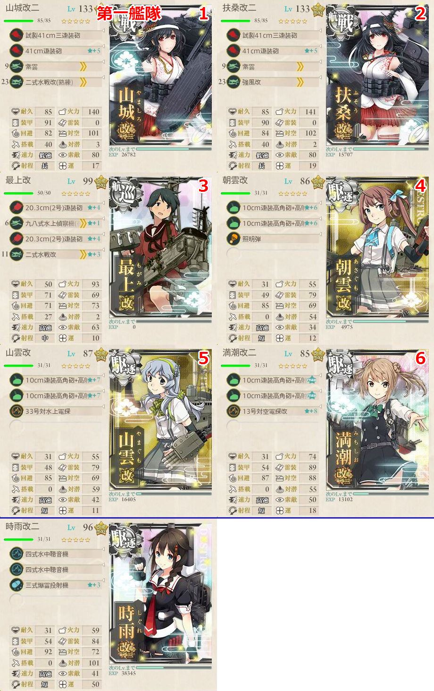

ルート    |判定 |艦娘   |備考
:---      |:---:|:---:  |:---
EIMNSWYZ9 |S    |綾波   |

#### 攻略
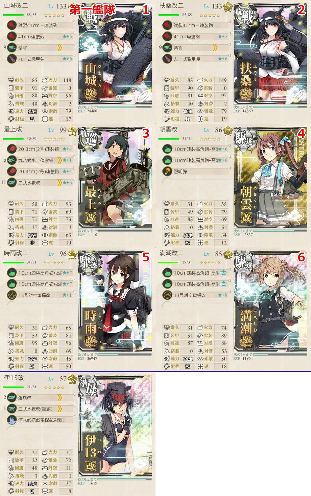

ルート            |判定 |艦娘   |備考
:---              |:---:|:---:  |:---
EIMNSWYZ9         |撤退 |       |
EIMNSWYZ9ZZ1ZZ2ZZ3|A    |朝雲   |
EIMNSWYZ9         |撤退 |       |
EI                |撤退 |       |
EIM               |撤退 |       |
EIMNSWYZ9ZZ1ZZ2   |撤退 |       |
EIMNSWYZ9         |撤退 |       |
EIMNS             |撤退 |       |
EIMNSWYZ9ZZ1ZZ2ZZ3|A    |金剛   |道中支援
EIMNSWYZ9ZZ1ZZ2ZZ3|A    |最上   |
EIMNSWYZ9ZZ1ZZ2ZZ3|A    |朝雲   |
EIMNSWYZ9ZZ1ZZ2ZZ3|A    |朝雲   |戦力ゲージ１ラスト 道中支援・決戦支援
EIMNSWYZ9ZZ1ZZ2ZZ3|A    |時雨   |戦力ゲージ１破壊
EIMNSWYZ9ZZ1ZZ2ZZ3|A    |比叡   |道中支援
EIM               |撤退 |       |
EIMNSWYZ9ZZ1ZZ2ZZ3|A    |鈴谷   |
EIMNSWYZ9ZZ1ZZ2ZZ3|A    |榛名   |
EIMNSWYZ9ZZ1ZZ2ZZ3|A    |鬼怒   |道中支援・決戦支援

