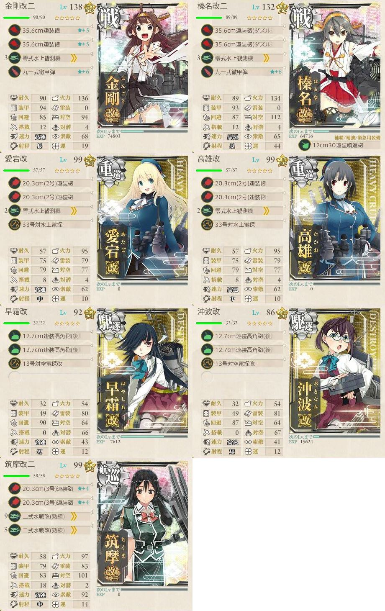

# 【艦これ】2018冬イベ  捷号決戦！邀撃、レイテ沖海戦(後篇)
## 資材状況

状況      |燃料   |弾薬   |鋼材   |ボーキ |バケツ
:--:      |---:   |---:   |---:   |---:   |---:
開始前    |296,746|287,636|292,813|293,100|3,000
E-1攻略後 |294,409|287,385|292,738|292,966|2,991
E-2攻略後 |289,295|284,467|290,245|291,198|2,971
E-3攻略後 |275,807|278,993|287,409|279,525|2,939
E-4攻略後 |253,030|266,474|271,651|285,776|2,950
E-5攻略後 |216,305|250,251|272,644|277,957|2,704
E-6攻略後 |211,372|245,635|271,584|279,749|2,708
E-7攻略後 |222,676|250,417|271,651|277,210|2,757

## E-1  「作戦開始 前路哨戒を厳とせよ！」
試製東海は甲作戦のみの報酬なので、甲作戦を選択します。  

#### 編成(F、N、攻略)

#### 編成(B)

### 出撃
ルート  |判定   |艦娘   |備考
:---    |:---:  |:---:  |:---
DGJKN   |S      |北上   |
DEF     |S      |       |
ABC     |       |       |
DEHIO   |S      |隼鷹   |基地航空隊(対潜)
DEHIO   |S      |瑞鳳   |
DEHI    |撤退   |       |
DEHIO   |S      |日向   |
DEH     |撤退   |       |
DEHIO   |S      |高雄   |
DEHIO   |S      |まるゆ |
DEHI    |撤退   |       |
DEHIO   |A      |鬼怒   |
DEHIO   |S      |妙高   |クリア

## E-2  「威風堂々 出撃！栗田艦隊」
そこまで難易度が高くないので、甲作戦を選択します。  
二式爆雷が不要なら乙作戦がおすすめ。  

#### 編成(X、Y)

#### 編成(T)

#### 編成(攻略)

### 出撃
ルート  |判定   |艦娘   |備考
:---    |:---:  |:---:  |:---
DGJMOSXY|S      |瑞穂   |
BEFILPQT|撤退   |       |
LPQTUVWZ|S      |夕雲   |
LPQTUVWZ|S      |野分   |
LPQTUVWZ|A      |鳳翔   |
LPQTUVWZ|S      |藤波   |
LPQTUVWZ|A      |高雄   |
LPQTUVWZ|S      |長波   |クリア

## E-3  「小沢機動部隊 全力出撃！」
甲作戦を選択。  
四式戦疾風が微妙なので、厳しい場合は乙でもよいと思います。  
下記の編成＋装備で、ラスダンでもボス航空優勢とれました。  

#### 編成(H)

#### 編成(S、攻略)

### 出撃
ルート  |判定   |艦娘   |備考
:---    |:---:  |:---:  |:---
AB      |撤退   |       |潜×4
ABCDFGH |       |       |潜×6
ABC     |撤退   |       |潜×1、道中支援
AB      |撤退   |       |
AD      |撤退   |       |編成変更、支援なし
ADFGH   |       |       |
AD      |撤退   |       |
ADF     |撤退   |       |
ADFG    |撤退   |       |
AD      |撤退   |       |完全防空
LJKNQSU |A      |筑摩   |ギミック解除
LJNQSU  |S      |高雄   |
LJNQS   |撤退   |       |
LJNQSU  |S      |長門   |
LJNQSU  |S      |霧島   |
LJNQSU  |S      |瑞鶴   |
LJNQS   |撤退   |       |
LJNQSU  |S      |愛宕   |
LJN     |撤退   |       |
LJNQS   |撤退   |       |
LJN     |撤退   |       |決戦支援
LJNQSU  |S      |加賀   |クリア

## E-4  「サマール沖 その先へ――」
甲と乙の報酬の差が戦闘詳報のみです。  
新艦娘が二隻、他にもボスのドロップが良いということなので乙で挑戦します。  

到達率優先で基地航空隊の１部隊はAマスに対潜で出撃。  
もう１部隊はボス前 or ボスに出撃させました。  

#### 編成(N)

#### 編成(攻略)

### 出撃
ルート      |判定   |艦娘   |備考
:---        |:---:  |:---:  |:---
CFHKMN      |S      |早霜   |ギミック解除
ABEILOQ     |撤退   |       |道中支援
ABEILOQ     |撤退   |       |
ABEILOQSR   |撤退   |       |
ABEILOQSRX  |S      |比叡   |
ABEILOQ     |撤退   |       |
ABEILOQSRX  |S      |霧島   |
ABEILOQ     |撤退   |       |
A           |撤退   |       |
ABEILOQSRX  |S      |金剛   |
ABEILOQSRX  |S      |金剛   |
ABEILOQSRX  |A      |長波   |
ABEILOQSR   |撤退   |       |
ABEILOQSRX  |A      |大東   |
ABEILOQSRX  |A      |涼風   |
ABEILOQSRX  |A      |利根   |道中支援、決戦支援
ABEILOQSRX  |A      |筑摩   |
ABEILOQSRX  |S      |雪風   |彩雲→艦戦に変更、クリア

## E-5  「多号作戦改」
駆逐艦装備にあまり興味が無いので、乙で攻略します。  
基地航空隊の１部隊をボスに、残りの１部隊を空襲マスに分散しました。  
道中は警戒陣でやり過ごします。  

#### 編成(輸送)

#### 編成(ギミック解除)

#### 編成(攻略)

### 出撃
ルート      |判定   |艦娘   |備考
:---        |:---:  |:---:  |:---
CDEGFHIJL   |S      |由良   |TP:98
CDEGFHIJL   |S      |       |
CDEGFHIJL   |S      |       |
CDEGFHIJL   |S      |大東   |
CD          |撤退   |       |
CDEGFHIJL   |S      |初春   |TP:69(途中退避あり)
CDEGFHIJL   |S      |木曾   |
CDEGFHIJL   |S      |朝風   |対空装備増加、輸送ゲージ破壊
CD          |撤退   |       |防空失敗、Dマス制空均衡
CD          |撤退   |       |Dマス航空優勢
CDEGF       |撤退   |       |防空航空優勢、戦力ゲージ開放
ONPT        |S      |松風   |道中支援(警戒陣なら不要かも？)
ONPT        |S      |三隈   |支援なし
ONPT        |S      |浜波   |
ONPT        |S      |沖波   |クリア
ONPT        |S      |浜風   |
ONPT        |S      |藤波   |
ONPT        |S      |浜風   |
ONPT        |S      |早霜   |
ONPT        |S      |妙高   |
ONPT        |S      |鈴谷   |S10
ONPT        |A      |藤波   |
ONPT        |S      |浜風   |
ONPT        |S      |高雄   |
ONPT        |S      |浦風   |
ONPT        |S      |阿賀野 |
ONPT        |S      |朝霜   |
ONPT        |S      |愛宕   |
OR          |撤退   |       |初戦で１隻退避
ONPT        |S      |鈴谷   |
ONPT        |S      |高雄   |
ONPT        |S      |浜風   |
ON          |撤退   |       |
ONPT        |S      |清霜   |S20
ONPT        |A      |足柄   |
ONPT        |S      |最上   |
ONPT        |S      |浜風   |
ONPT        |S      |浜風   |
OR          |撤退   |       |初戦で１隻退避
ONPT        |A      |浜風   |
ONPT        |S      |浜風   |
ONP         |撤退   |       |
ONPT        |S      |浦風   |
ONPT        |S      |熊野   |
ONPT        |S      |藤波   |
ONPT        |S      |沖波   |
O           |撤退   |       |
ONP         |撤退   |       |
ONPT        |A      |那智   |
ONPT        |S      |熊野   |
ONPT        |S      |浦風   |S30
ONPT        |S      |浜風   |
ONPT        |S      |霧島   |三隈、潮の二隻退避でもボス到達
ONPT        |S      |清霜   |
ONPT        |S      |浦風   |
ONPT        |S      |金剛   |
ONPT        |S      |愛宕   |
ONPT        |S      |阿賀野 |
ONPT        |S      |長良   |
O           |撤退   |       |
ONPT        |S      |金剛   |
ONPT        |S      |鈴谷   |S40
ONPT        |S      |島風   |
ONPT        |S      |藤波   |
ONPT        |S      |清霜   |
O           |撤退   |       |
ONPT        |S      |長良   |
ONPT        |S      |藤波   |
ONPT        |A      |早霜   |
ONPT        |S      |時津風 |
ONPT        |S      |鈴谷   |
ONPT        |S      |沖波   |
ONPT        |S      |熊野   |
ONPT        |S      |時津風 |S50
ONPT        |S      |浜風   |
ONPT        |S      |愛宕   |
ONPT        |S      |浦風   |
ONPT        |S      |秋雲   |
ONPT        |S      |最上   |
O           |撤退   |       |
ONPT        |S      |榛名   |
O           |撤退   |       |
ONPT        |S      |高雄   |
O           |撤退   |       |
O           |撤退   |       |
ONPT        |S      |三隈   |
O           |撤退   |       |
ONPT        |S      |浜風   |
ONPT        |S      |高雄   |S60
O           |撤退   |       |
ONPT        |S      |長良   |
O           |撤退   |       |
ON          |撤退   |       |
ONPT        |S      |浦波   |
ONPT        |S      |阿賀野 |
ONPT        |A      |千代田 |
ONPT        |S      |早霜   |
ONPT        |S      |天津風 |
ONPT        |S      |高雄   |
ONPT        |S      |浜風   |
ONPT        |S      |浜風   |
ONP         |撤退   |       |
ONPT        |S      |熊野   |
ONPT        |A      |多摩   |
ONPT        |S      |清霜   |S70
ONPT        |S      |最上   |
O           |撤退   |       |
ONPT        |S      |球磨   |
ONPT        |S      |早霜   |
ONPT        |S      |藤波   |
ONPT        |S      |愛宕   |
ONPT        |S      |筑摩   |
ONPT        |S      |天津風 |
ONPT        |S      |浜風   |
ONPT        |S      |霧島   |
ONPT        |S      |比叡   |S80
ONPT        |S      |藤波   |朝潮→涼月に変更
ONPT        |S      |浦風   |
ONPT        |S      |藤波   |
ONPT        |S      |衣笠   |
ONPT        |S      |榛名   |
ONPT        |S      |野分   |
ONPT        |S      |浦風   |
ONPT        |A      |加古   |
ONPT        |S      |熊野   |
ONPT        |S      |浜風   |
ONPT        |S      |藤波   |S90
ONPT        |S      |秋雲   |
ONPT        |S      |Jervis |

## E-6  「追撃！第二遊撃部隊」
Jervis掘りで沼ったんで攻略＆全艦コンプ最優先のため、丙を選択。  

第１ゲージの道中は対潜マップ以外は全て警戒陣でやり過ごします。  
空襲マスの最適解は輪形陣なのか警戒陣なのかは正直なところ不明です。  
対空CIがあれば輪形の方が良いんですかね…？  

第２ゲージの道中は単縦陣で問題ありませんでした。  
敵がそこまで強くないので雷巡を入れたほうが安定感あります。  

第３ゲージは基地航空隊＋友軍支援があるので、道中対策が重要です。  
それでも大破するときは(丙でも)大破します。  

#### 編成(第１ゲージ)

#### 編成(Iマス)

#### 編成(第２ゲージ)

#### 編成(攻略)

### 出撃
ルート      |判定   |艦娘           |備考
:---        |:---:  |:---:          |:---
ABCDHGOPU   |S      |叢雲           |
ABCDHGOPU   |S      |               |
ABCDHGOPU   |S      |那智           |戦力ゲージ1破壊
FJNLI       |S      |長良           |ギミック解除
FJNL        |撤退   |               |
FJNLQV      |S      |               |
FJNLQV      |S      |曙             |愛宕→木曾
FJNLQV      |A      |那珂           |
FJNL        |撤退   |               |
FJNLQV      |S      |足柄           |戦力ゲージ2破壊
ABCDHGORW   |S      |Гангут   |
ABCDHGORW   |S      |舞風           |
ABCDHGORW   |S      |古鷹           |
ABCDHGOR    |撤退   |               |
ABCDH       |撤退   |               |
ABCDHGORW   |S      |夕雲           |クリア
ABCDHGORW   |S      |大淀           |
ABCDHGORW   |S      |愛宕           |
ABCDHGORW   |S      |摩耶           |
ABCDHGORW   |S      |夕雲           |
ABCDHGORW   |S      |秋雲           |
ABCDHGORW   |S      |榛名           |
ABCDHGORW   |S      |秋雲           |
ABCDHGORW   |S      |巻雲           |
ABCDHGOR    |撤退   |               |
ABCDHGORW   |S      |Ташкент |

## E-7  「暁の水平線に勝利を──」
掘りで資源を使って疲れたので、攻略優先の丁でいきます。  

Qマスへは空母機動部隊(低速艦0隻)が条件みたいです。  

第１ゲージは３月から？友軍支援が来るようになったので、たどり着けば撃破はそう難しくはありません。  
第２ゲージは、BOSS前が警戒陣の水雷戦隊なのでちょっと危ないです。  

#### 編成(Qマス)

#### 編成(Vマス、Hマス)

#### 編成(攻略)

### 出撃
ルート  |判定   |艦娘   |備考
:---    |:---:  |:---:  |:---
BCDIMQ  |S      |加賀   |
EFJNTUV |S      |菊月   |
EFJNTUV |S      |       |
EFJNTUV |S      |綾波   |ゲージ1破壊
EFJKLH  |撤退   |       |
BCDIMWX |S      |衣笠   |ギミック(B→D)解除
BDIMWX  |S      |瑞鶴   |
BDIMWX  |S      |熊野   |
BDIMWX  |S      |清霜   |
BDIMWX  |S      |翔鶴   |
BDIMWX  |S      |霧島   |クリア

