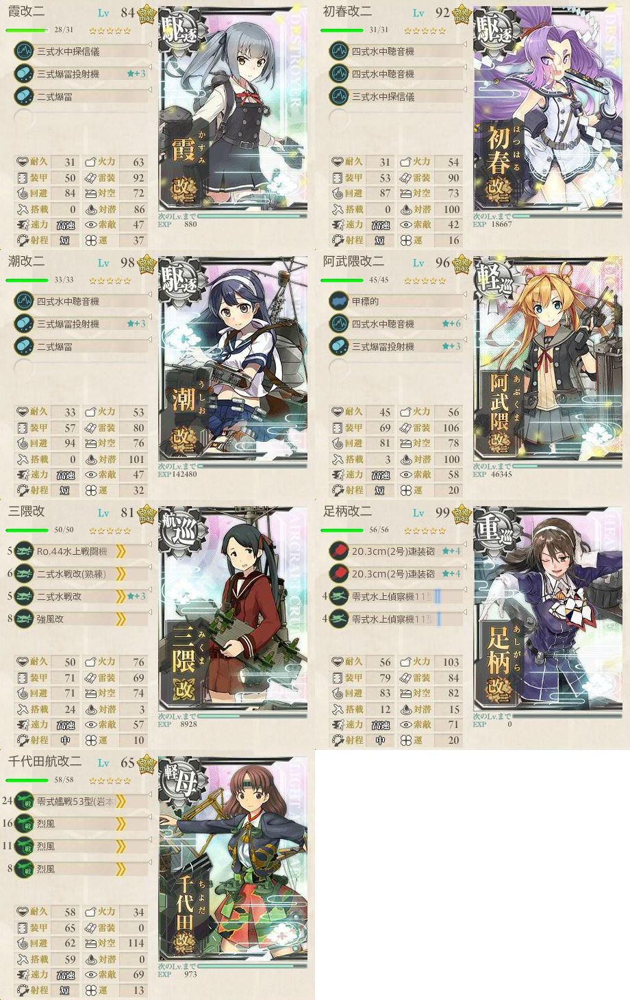
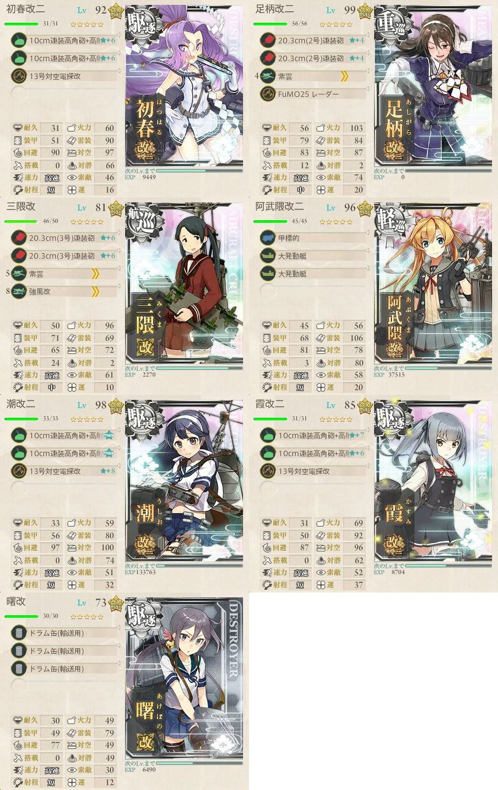

# 【艦これ】2017秋イベ  捷号決戦！邀撃、レイテ沖海戦(前篇)

## 資材状況

状況      |燃料   |弾薬   |鋼材   |ボーキ |バケツ
:--:      |---:   |---:   |---:   |---:   |---:
開始前    |298,793|297,960|298,092|299,694|2,999
E-1攻略後 |297,046|297,303|298,674|296,305|2,987
E-2攻略後 |285,793|284,523|295,644|295,937|2,927

## E-1「第二遊撃部隊、抜錨！」
甲と報酬がほとんど変わらないため、乙作戦で攻略を開始する。

### 乙作戦
#### ギミック解除

隼＋艦戦3で制空マスに基地航空支援隊を出撃。

ルート  |判定 |艦娘 |備考
:---    |:---:|:---:|:---
ABCGDEHF|     |     |
ABCGJKL |     |     |潜水艦単艦 ギミック解除
ABCGJMNP|     |     |
ABCGJMOS|S    |飛鷹 |ギミック解除→BOSS突入

#### 攻略

陸攻4でBOSSマスに基地航空支援隊を出撃。

ルート  |判定 |艦娘   |備考
:---    |:---:|:---:  |:---
ABCGJMOS|S    |秋雲   |道中支援(対潜)
ABCGJMOS|S    |伊勢   |
ABCGJMOS|S    |飛鷹   |
ABCGJMOS|S    |阿武隈 |ラストダンス 決戦支援

---

## E-2「捷一号作戦、発動準備」
### 甲作戦
遊撃部隊で7隻編成のため、第三艦隊を使用。

#### ギミック解除

ルート|判定 |艦娘 |備考
:---  |:---:|:---:|:---
ABCEGJ|S    |若葉 |
AD    |     |     |

#### 攻略

試行錯誤した結果、下記の編成が最終型。

ルート|判定 |艦娘   |備考
:---  |:---:|:---:  |:---
QLM   |撤退 |       |道中支援
QLM   |撤退 |       |
QLMN0 |     |       |索敵漏れ 装備変更
QLMNP |A    |春雨   |TP45
QL    |撤退 |       |
QLMNP |S    |能代   |TP65
QL    |撤退 |       |阿武隈の装備を主砲2に変更
QLMNP |D    |       |
QL    |撤退 |       |三隈・阿武隈の装備を変更
QLMNP |C    |       |
QLMNP |A    |阿賀野 |TP39 決戦支援に変更 装備変更
Q     |撤退 |       |
QL    |撤退 |       |
QLMNP |A    |野分   |TP45
QL    |撤退 |       |
QL    |撤退 |       |
QLMNP |A    |対馬   |TP45
QLMNP |S    |清霜   |TP65
QL    |撤退 |       |
QLMNP |A    |青葉   |TP45
QLMNP |A    |谷風   |TP25
QL    |撤退 |       |
QLMNP |A    |熊野   |TP26

---

## E-3「捷一号作戦、作戦発動！」
### 甲作戦
#### ギミック解除

ルート|判定 |艦娘 |備考
:---  |:---:|:---:|:---

---

