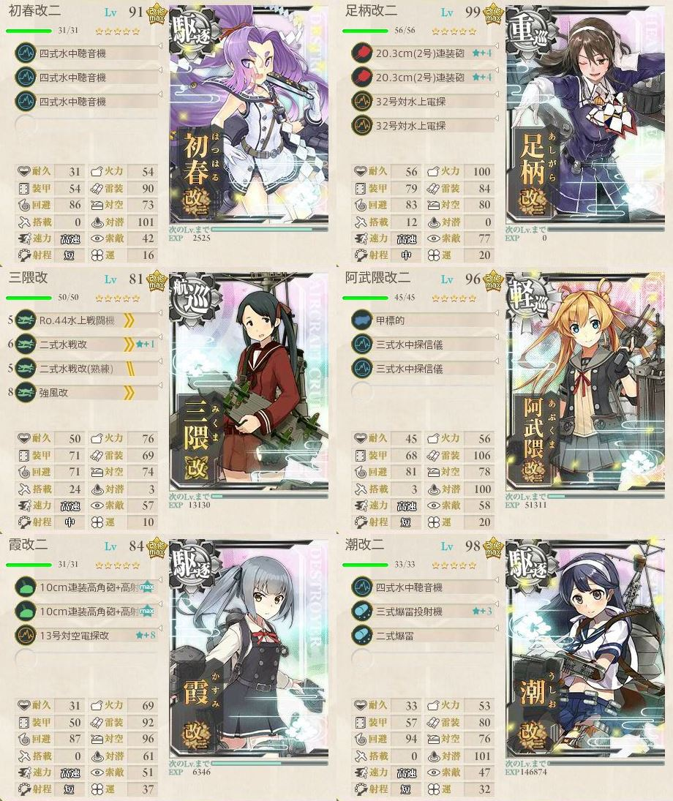
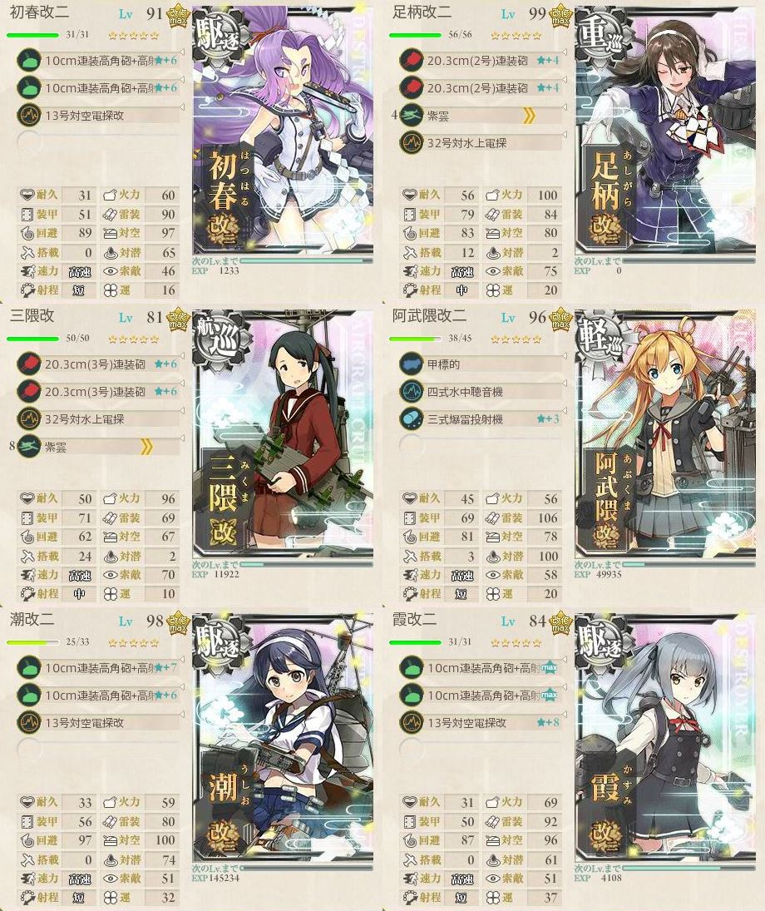
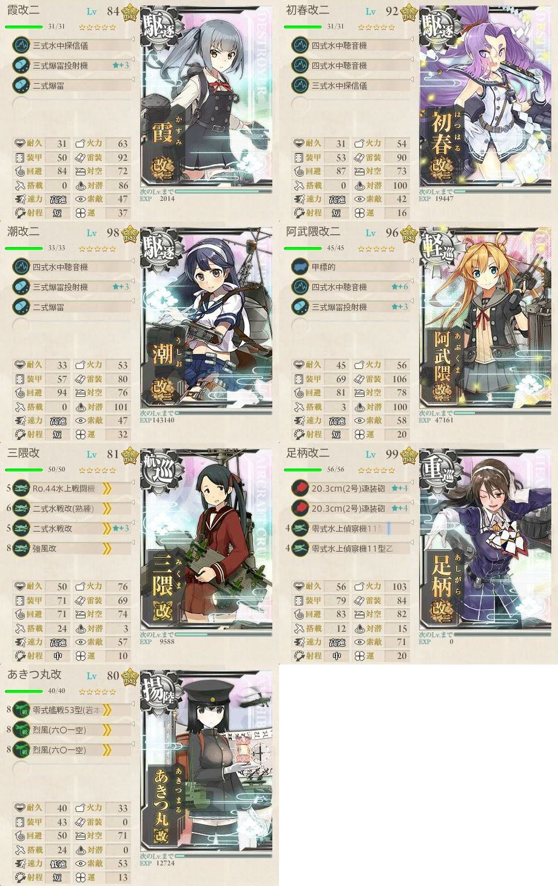
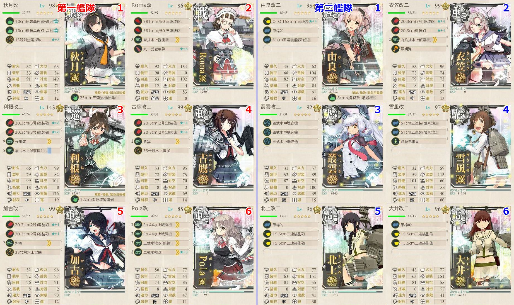

# 【艦これ】2017秋イベ  捷号決戦！邀撃、レイテ沖海戦(前篇)
## E-1「第二遊撃部隊、抜錨！」
甲と報酬がほとんど変わらないため、乙作戦で攻略を開始する。

### 乙作戦
#### ギミック解除

隼＋艦戦3で制空マスに基地航空支援隊を出撃。

ルート  |判定 |艦娘 |備考
:---    |:---:|:---:|:---
ABCGDEHF|     |     |
ABCGJKL |     |     |潜水艦単艦 ギミック解除
ABCGJMNP|     |     |
ABCGJMOS|S    |飛鷹 |ギミック解除→BOSS突入

#### 攻略

陸攻4でBOSSマスに基地航空支援隊を出撃。

ルート  |判定 |艦娘   |備考
:---    |:---:|:---:  |:---
ABCGJMOS|S    |秋雲   |道中支援(対潜)
ABCGJMOS|S    |伊勢   |
ABCGJMOS|S    |飛鷹   |
ABCGJMOS|S    |阿武隈 |ラストダンス 決戦支援

---

## E-2「捷一号作戦、発動準備」
### 甲作戦
#### ギミック解除

ルート|判定 |艦娘 |備考
:---  |:---:|:---:|:---

---

## E-3「捷一号作戦、作戦発動！」
### 甲作戦
#### ギミック解除

ルート|判定 |艦娘 |備考
:---  |:---:|:---:|:---

---

